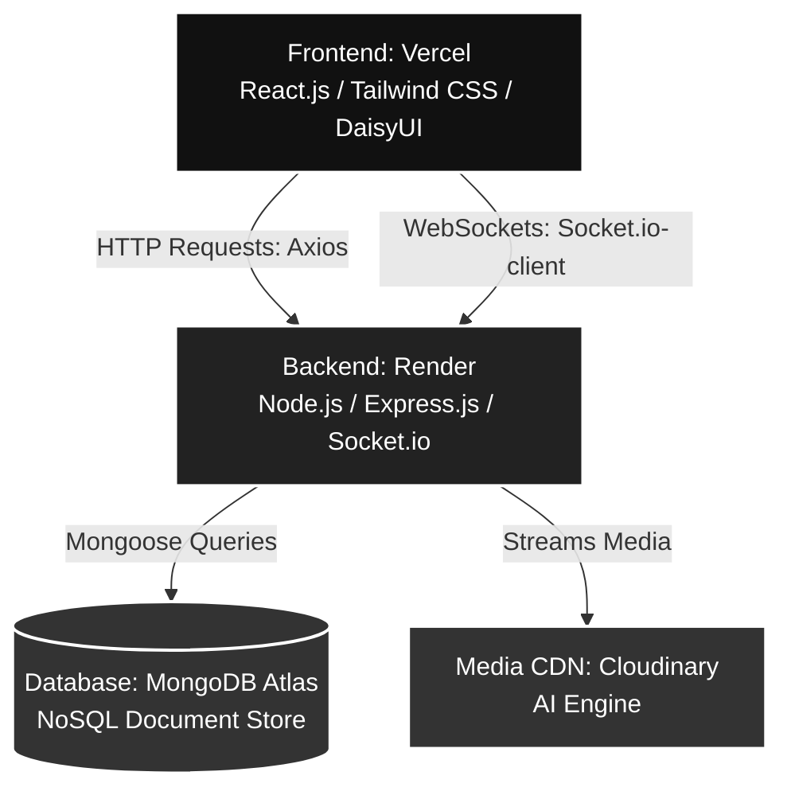

# CampusFindIt 🔍

A modernized, real-time, production-ready Full-Stack (MERN) web application designed to bridge communication gaps on college campuses for lost and found items. The platform features an automated asynchronous media processing pipeline, AI-powered computer vision tagging, automated cascading data lifecycles, and a persistent bi-directional communication layer.

### 🌐 [Live Application](https://campus-find-it.vercel.app)

---

## 🏛️ System Architecture

The application adopts a decoupled, stateless micro-scale architecture designed to maximize resource performance, minimize asset payload delivery latency, and enforce separation of concerns across infrastructure layers.


## 🛠️ Complete Tech Stack Specs

* **Frontend Client:** React.js, Vite Ecosystem, Tailwind CSS Core, DaisyUI Component Suite
* **Runtime Backend:** Node.js, Express.js Framework
* **Real-time Communication:** Socket.io (WebSocket Protocol Engine)
* **Data Tier Layering:** MongoDB Atlas (NoSQL Distributed Document Cloud Architecture), Mongoose ODM
* **Media Processing:** Cloudinary AI Automation API Core
* **Infrastructure Hosting:** Vercel Global Edge Network (Frontend Client Assets), Render Cloud Compute Engine (Stateful Backend Server Engine)

---

## ⚙️ Local Workspace Initialization

### Prerequisites
* Node.js (v18.x or above)
* NPM / Yarn Packagers
* MongoDB Cloud Cluster or Local Instance URI

### Environment Matrix Configurations

Create `.env` profiles inside their respective server and client root folders.

#### Backend Directory Server (`/backend/.env`)
```env
PORT=5000
MONGODB_URI=your_mongodb_uri
JWT_SECRET=your_super_secure_long_random_string_secret
CORS_ORIGIN=http://localhost:5173
BCRYPT_SALT_ROUNDS=your_bcrypt_salt_rounds
```
#### Frontend Directory Client (`/frontend/.env`)
```env
VITE_API_URL=http://localhost:5000/api/v1
VITE_BACKEND_URL=http://localhost:5000
VITE_CLOUDINARY_API_URL=your_cloudinary_api_url
VITE_CLOUDINARY_PRESET_NAME=your_unsigned_upload_preset
```

### Installation Steps

Follow these steps sequentially to spin up the local development environment.

#### 1. Setup & Launch the Backend Server
Open your terminal from the project root folder and execute:
```bash
cd backend
npm install
npm run dev
```
#### 2. Setup & Launch the Frontend Client
Open a second, separate terminal window from your project root folder and run:
```bash
cd frontend
npm install
npm run dev
```
Once the compilation is complete, open your browser and navigate to:
👉 http://localhost:5173
