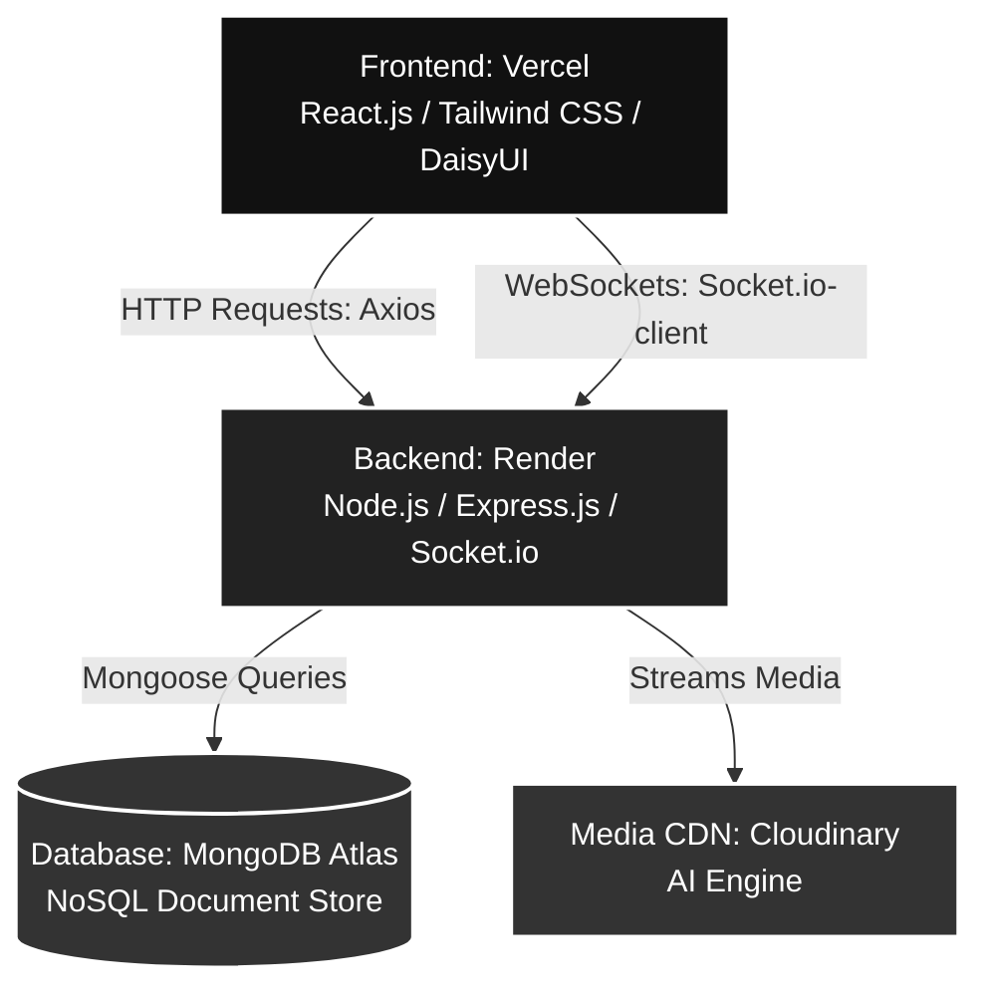

# CampusFindIt

A real-time Lost & Found portal built for college campuses. Students post lost or found items and communicate directly with each other through live chat — no more scattered WhatsApp groups or notice boards.

**[Live Application →](https://campus-find-it.vercel.app)**

---

## What it does

- Post lost or found items with photos, category, and location details
- Browse and search items posted across campus
- Claim an item and instantly open a private real-time chat with the owner
- Receive and send messages without page refresh via persistent WebSocket connections
- Secure authentication with JWT — only verified users can post or claim

---

## Key Technical Decisions

**Direct-to-CDN image uploads**
Images upload from the browser directly to Cloudinary, bypassing the backend entirely. The server only receives a lightweight URL string. This keeps binary data off the Node.js event loop and avoids multipart/form-data parsing overhead on the server.

**WebSocket authentication via `io.use()` middleware**
HTTP requests carry JWTs in the `Authorization` header, but browser WebSocket connections don't support custom headers. Tokens are passed in the Socket.io handshake `auth` object and validated in server-side `io.use()` middleware before any socket connection is established — unauthenticated clients never reach a room.

**Mongoose cascade middleware for referential integrity**
MongoDB has no native foreign key constraints. When an item post is deleted or resolved, `pre('deleteOne')` hooks automatically clean up associated chat rooms and messages, preventing orphaned documents across collections.

---

## Architecture



**Deployment:** Frontend on Vercel, backend on Render
**Auth flow:** Stateless JWT — signed on login, verified in Express middleware on every protected route and in `io.use()` for socket connections

---

## Tech Stack

| Layer | Technology |
|---|---|
| Frontend | React.js, Vite, Tailwind CSS, DaisyUI |
| Backend | Node.js, Express.js |
| Real-time | Socket.io (WebSockets) |
| Database | MongoDB Atlas, Mongoose |
| Auth | JWT (JSON Web Tokens), bcrypt |
| Media | Cloudinary (direct browser upload) |
| Deployment | Vercel (frontend), Render (backend) |

---

## Running locally

### Prerequisites
- Node.js v18+
- A MongoDB Atlas URI (or local MongoDB instance)
- A Cloudinary account with an unsigned upload preset

### 1. Clone the repo

```bash
git clone https://github.com/BimalSinha59/CampusFindIt.git
cd CampusFindIt
```

### 2. Set up the backend

```bash
cd backend
npm install
```

Create `backend/.env`:

```env
PORT=5000
MONGODB_URI=your_mongodb_uri
JWT_SECRET=your_jwt_secret_key
CORS_ORIGIN=http://localhost:5173
BCRYPT_SALT_ROUNDS=your_bcrypt_salt_rounds
```

```bash
npm run dev
```

### 3. Set up the frontend

```bash
cd ../frontend
npm install
```

Create `frontend/.env`:

```env
VITE_API_URL=http://localhost:5000/api/v1
VITE_BACKEND_URL=http://localhost:5000
VITE_CLOUDINARY_API_URL=your_cloudinary_api_url
VITE_CLOUDINARY_PRESET_NAME=your_unsigned_preset
```

```bash
npm run dev
```

Open [http://localhost:5173](http://localhost:5173)

---

## Known limitations and future improvements

- **JWT storage:** Tokens currently stored in `localStorage`. Production upgrade path is `httpOnly` cookies with `SameSite=Strict` to eliminate XSS risk.
- **Socket.io scaling:** Single-server setup. Horizontal scaling would require the `@socket.io/redis-adapter` to sync room state across instances.
- **No tests:** Priority was shipping a working deployed product. Next step is Jest unit tests for auth middleware and integration tests for the socket claim lifecycle.
- **Push notifications:** Offline users miss claim notifications. Web Push API with a service worker is the planned approach.

---

## Author

**Bimal Kumar** — B.Tech Information Technology, NIT Raipur

[GitHub](https://github.com/BimalSinha59) · [LinkedIn](https://www.linkedin.com/in/bimal-sinha-36a7462ba/) · [LeetCode](https://leetcode.com/Bimalsinha)
