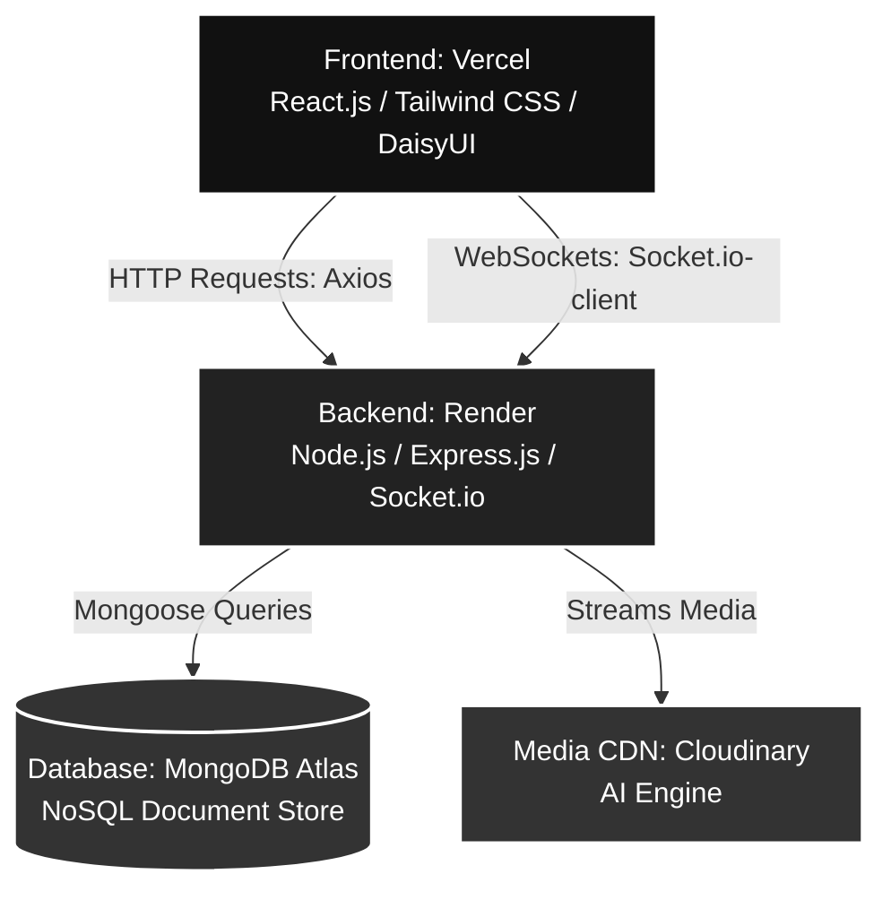

# CampusFindIt

A real-time Lost & Found portal built for college campuses. Students post lost or found items, search using AI-enriched tags, and communicate directly with each other through a verified claim workflow and live chat — no more scattered WhatsApp groups or notice boards.

**[Live Application →](https://campus-find-it.vercel.app)**

---

## What it does

- Post lost or found items with photos, category, location, and a verification question
- Search items using server-side full-text search across titles, descriptions, and AI-generated tags
- Filter items by type (LOST / FOUND) and category in real time
- Submit a claim by answering the reporter's verification question
- Receive an instant Socket.io notification when someone claims your item
- Approve or reject claims from your dashboard — approved claims unlock a private chat
- Chat in real time with the other party through persistent WebSocket connections
- Secure authentication with JWT — owner identity always derived server-side from the token, never from the request body

---

## Key Technical Decisions

**Secure Server-Side Media Processing:**
To protect API keys and ensure strict validation, media uploads are routed securely through the Node.js/Express backend to Cloudinary via multipart form data parsing (`multer`). This pattern prevents the exposure of unsigned upload presets on the client-side, allows the backend to validate file constraints (size, MIME type) before processing, and centralizes media storage management securely on the server.

**WebSocket authentication via `io.use()` middleware:**
HTTP requests carry JWTs in the `Authorization` header, but browser WebSocket connections don't support custom headers. Tokens are passed in the Socket.io handshake `auth` object and validated in server-side `io.use()` middleware before any socket connection is established — unauthenticated clients never reach a room.

**Explicit cascade deletion for referential integrity:**
MongoDB has no native foreign key constraints. When an item is deleted, the controller explicitly deletes all associated Claims and Conversations in sequence. When a claim is deleted, its Conversation and all Messages are removed first. This keeps the database clean without relying on Mongoose hooks, making the deletion logic visible and auditable in the controller layer.

---

## Architecture



**Deployment:** Frontend on Vercel, backend on Render

**Auth flow:** Stateless JWT — signed on login, verified in Express `verifyJWT` middleware on every protected route, and in `io.use()` for socket connections. Owner identity is always read from the verified token, never trusted from the request body.
 
**Socket.io rooms:**
- `<conversationId>` — isolated per approved claim, joined via `join_chat` event
- `user:<userId>` — personal room, auto-joined on every authenticated connection for targeted notifications

---

## Tech Stack

| Layer | Technology |
|---|---|
| Frontend | React 19, Vite 8, Tailwind CSS v4, DaisyUI v5 |
| Backend | Node.js, Express 5, Multer (memoryStorage) |
| Real-time | Socket.io 4 (WebSockets + personal notification rooms) |
| Database | MongoDB Atlas, Mongoose 9 |
| Auth | JWT (jsonwebtoken), bcryptjs |
| Media & AI | Cloudinary CDN, Google Cloud Vision AI (auto-tagging) |
| Search | MongoDB `$text` operator, compound text index |
| Deployment | Vercel (frontend), Render (backend) |

---

## Running locally

### Prerequisites
- Node.js v18+
- A MongoDB Atlas URI (or local MongoDB instance)
- A Cloudinary account with an unsigned upload preset

### 1. Clone the repo

```bash
git clone https://github.com/BimalSinha59/CampusFindIt.git
cd CampusFindIt
```

### 2. Set up the backend

```bash
cd backend
npm install
```

Create `backend/.env`:

```env
PORT=5000
MONGODB_URI=your_mongodb_uri
JWT_SECRET=your_jwt_secret_key
CORS_ORIGIN=http://localhost:5173
BCRYPT_SALT_ROUNDS=your_bcrypt_salt_rounds
CLOUDINARY_CLOUD_NAME=your_cloudinary_cloud_name
CLOUDINARY_API_KEY=your_cloudinary_api_key
CLOUDINARY_API_SECRET=your_cloudinary_api_secret
```

```bash
npm run dev
```

### 3. Set up the frontend

```bash
cd ../frontend
npm install
```

Create `frontend/.env`:

```env
VITE_API_URL=http://localhost:5000/api/v1
VITE_BACKEND_URL=http://localhost:5000
```

```bash
npm run dev
```

Open [http://localhost:5173](http://localhost:5173)

---

## Known limitations and future improvements

- **JWT storage:** Tokens currently stored in `localStorage`. Production upgrade path is `httpOnly` cookies with `SameSite=Strict` to eliminate XSS risk.
- **Socket.io scaling:** Single-server setup. Horizontal scaling would require the `@socket.io/redis-adapter` to sync room state across instances.
- **No tests:** Priority was shipping a working deployed product. Next step is Jest unit tests for auth middleware and integration tests for the socket claim lifecycle.
- **Push notifications:** Offline users miss claim notifications. Web Push API with a service worker is the planned approach.

---

## Author

**Bimal Kumar** — B.Tech Information Technology, NIT Raipur

[GitHub](https://github.com/BimalSinha59) · [LinkedIn](https://www.linkedin.com/in/bimal-sinha-36a7462ba/) · [LeetCode](https://leetcode.com/Bimalsinha)
